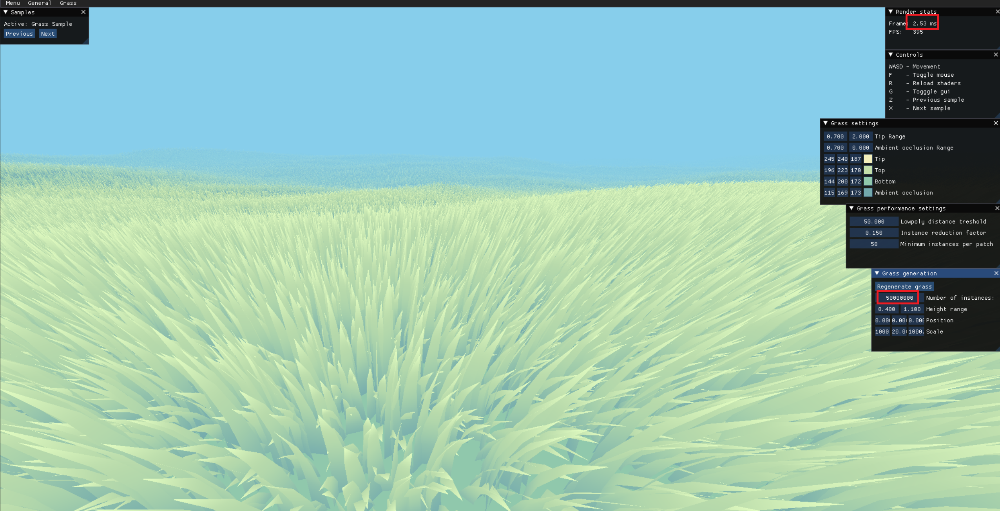
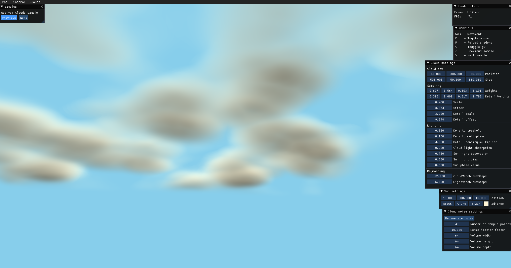

# Graphics-Showcase

## 1. Grass sample

 
This sample shows efficient way of drawing very high number of quality, animated individual grass blades.

The drawing of individual grass instances rely on instanced drawing as expected, but there is more to it. 
Here is a high level overview how the renderer works:

What is grass patch:
- The terrain is divided in grid
- Each cell in grid is represented by 1 grass patch
- Every grass patch consists of thousands of individial grass blades.
- 1 grass patch = 1 instanced drawcall
- Most of the culling work is done by grass patch

Culling/Optimization steps:
 - Frustum culling for each grass patch
 - LOD system - if the grass is far away, replace the mesh of grass blade with simpler one. In my case I have 2 meshes for grass, one with 9 triangles, and one with 1 triangle.
 - Reduce instance count by distance - the more distant the patch is, we are lowering the number of grass blades in that patch. This is tricky to do if you want to avoid grass suddenly poping. I think my approach really good for for this kind of scenario.

Drawing pipeline:
- We are using ExecuteIndirect to draw all of the grass at once
- Firstly we are preparing data in the compute shader where we do all of the steps I mentioned in Culling/Optimization steps
- The prepare data compute shader is running one thread per grass patch and we are generating max 1 drawcall per grass patch
- We are using 2 sets of indirect buffers, one for low poly drawcalls and one for high poly drawcalls
- At the end of are calling 2 execute indirect commands to draw all grass blades

More detailed overview will be written soon.

## 2. Clouds sample

Rendering clouds using raymarching technique. 
This approach is inspired by Sebastian Lague youtube video: "Coding Adventure: Clouds"

Still in progress
